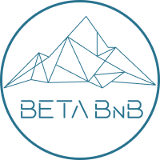

# Beta BnB

<!-- Description -->

  

 

  <!-- <h3 align="center">Restobook</h3> -->
  

    Online Hotel Rooms Booking  
    Pada saat ini, kemajuan teknologi mempermudah manusia untuk melakukan berbagai aktivitas sehari-hari. Salah satu hal yang dibutuhka manusia dalam menjalani kehidupannya adalah liburan.Dengan aplikasi ini akan memudahkan siapapun mendapatkan tempat menginap saat liburan dengan praktis dan efisien.
     

# Technology Stack

### Framework

- React Next Js + Tailwind CSS

### Package
 - [axios]( https://www.npmjs.com/package/axios )
 - [google-map-react]( https://www.npmjs.com/package/google-map-react )
 - [moment]( https://momentjs.com/ )
 - [react-datepicker]( https://reactdatepicker.com/ )
 - [react-icons]( https://react-icons.github.io/react-icons/ )
 - [react-number-format]( https://www.npmjs.com/package/react-number-format )
 - [react-onclickoutside]()
 - [react-popper]( https://popper.js.org/react-popper/ )
 - react-rating-stars
 - [React-redux]( https://react-redux.js.org/ )
 - [sweetalert2]( https://sweetalert2.github.io/recipe-gallery/sweetalert2-react.html )

### Collaboration

- [Trello (Manage projects)](https://trello.com)
- [Github (Cloud-based Git repository)](https://github.com)
- [Figma (Manage design)]

# Contact

- [Andrew Prasetyo] [FE] (https://github.com/RizkiAwenkCode) (Ketua Group)
- [Muhammad Yusuf U W] [FE] (https://github.com/myusufuntung)
- [Aditya Fabio H] [FE] (https://github.com/fabioaditya)
- [Yusuf Nur Wahid] [BE] (https://github.com/ynwahid)
GitHub
RizkiAwenkCode - Overview
RizkiAwenkCode has 2 repositories available. Follow their code on GitHub.
